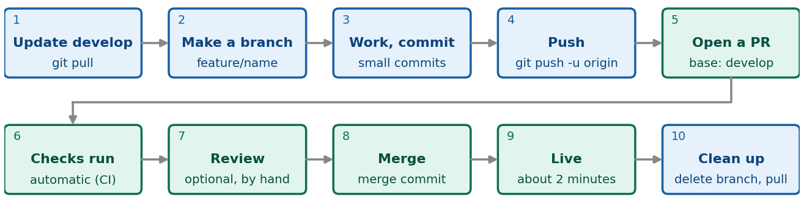
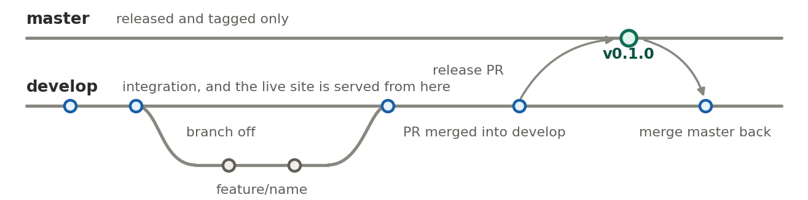

```{=latex}
\pagestyle{empty}\thispagestyle{empty}
\setlength{\parskip}{0.35em}
\setlength{\parindent}{0pt}
\renewcommand{\arraystretch}{1.1}
\vspace*{-1.2em}
\begin{center}
{\LARGE\bfseries\color{brand} Developer workflow}\\[0.2em]
{\small NSDF-Data \textperiodcentered{} Git Flow and semantic versioning \textperiodcentered{} version 1, 7 October 2026}
\end{center}
\vspace{0.3em}
```

**A pull request (PR)** is a page on GitHub that says "please merge branch X into branch Y". It shows the changes, runs the automatic checks, and keeps the discussion in one place. **Nothing reaches `develop` until you press Merge.** `develop` is where work lands and what the live site is served from; `master` holds tagged releases only.

{width=100%}

```{=latex}
{\footnotesize\textit{The loop for every change. Blue: on your computer. Teal: on GitHub. A check turns red? Fix it on the same branch and push again; the PR updates.}}
```
```{=html}
<p class="caption">The loop for every change. Blue: on your computer. Teal: on GitHub. A check turns red? Fix it on the same branch and push again; the PR updates.</p>
```

```{=latex}
\footnotesize
```

```bash
git switch develop && git pull                      # 1  start from the latest develop
git switch -c feature/my-change                     # 2  your branch
git add <files> && git commit -m "What and why"     # 3  small commits; update CHANGELOG.md
git push -u origin feature/my-change               # 4
gh pr create --base develop --fill                  # 5  or "Compare & pull request" on GitHub
# 6-9: checks run, optional review, press Merge (merge commit), the site updates
git switch develop && git pull && git branch -d feature/my-change   # 10
```

```{=latex}
\normalsize
```

{width=100%}

```{=latex}
{\footnotesize\textit{Branches over time. A feature merges into \texttt{develop} through a PR. A release goes to \texttt{master}, is tagged, and \texttt{master} is merged back.}}
```
```{=html}
<p class="caption">Branches over time. A feature merges into <code>develop</code> through a PR. A release goes to <code>master</code>, is tagged, and <code>master</code> is merged back.</p>
```

**Making a release**, when there is something to version: branch `release/X.Y.Z` from `develop`, set `VERSION` and date `CHANGELOG.md`, open a PR into `master` and merge it, tag `vX.Y.Z` on the merge commit, merge `master` back into `develop`, publish the GitHub release, delete the branch. Bump **major** for a breaking library change (not while 0.x), **minor** for a new capability, **patch** for fixes and content. A guide or site fix is an ordinary feature PR. A **hotfix** is only for a bug in a released version.

**Special cases.** *A student note:* the PR into `develop` runs the check only, and nothing is visible; you replace `TBD` with an S-number and merge, the bot builds the page, and it is live in 2 to 3 minutes (delete the source file to remove a note). *A contributor such as Kitty:* they open a PR into `develop`, you are requested automatically, and you add other reviewers by hand. *An AI agent:* may open PRs, and never merges without your go-ahead.

**Never** commit directly to `master` or `develop`, and never force-push (the rulesets block both).\
Details are in the repository: `RELEASING.md`, `AGENTS.md`, `CHANGELOG.md`.
