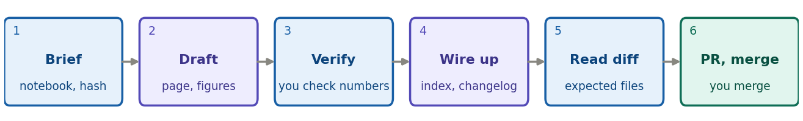

```{=latex}
\pagestyle{empty}\thispagestyle{empty}
\setlength{\parskip}{0.3em}
\setlength{\parindent}{0pt}
\renewcommand{\arraystretch}{1.05}
\vspace*{-1.2em}
\begin{center}
{\LARGE\bfseries\color{brand} Creating a note with an AI agent}\\[0.2em]
{\small Developer quick-sheet \textperiodcentered{} Claude Code or a similar agent \textperiodcentered{} version 1, 7 October 2026}
\end{center}
\vspace{0.2em}
```

The agent does the mechanical work. **You own every number, every reading and every conclusion.** Start it in the `NSDF-Data` folder and it reads `CLAUDE.md` and `AGENTS.md`, so it already knows the branch and pull request rules. This sheet pairs with the developer sheet, [creating a note](https://villano-lab.github.io/NSDF-Data/developers/note-creation.html). Students use [guide 5](https://villano-lab.github.io/NSDF-Data/students/publishing-with-ai.html).

{width=100%}

```{=latex}
{\footnotesize\textit{Blue: you. Purple: the agent. Teal: GitHub. Every hand-over is a point where you check its work.}}
```
```{=html}
<p class="caption">Blue: you. Purple: the agent. Teal: GitHub. Every hand-over is a point where you check its work.</p>
```

**Before you start:** `git switch develop && git pull`, then a clean `git status` on a `feature/note-NN-short-name` branch. The notebook is run and committed; you have its short hash.

**A starting brief** (fill in the brackets):

> Write note `[NN]` from `[notebook]`, committed at `[hash]`. Copy the structure of `docs/notes/note-02a-bstd-vs-time.html`. Save the figures from the executed notebook into `docs/notes/img/`. Pin every notebook and `python/` link to the hash and verify each with `git cat-file -e`. Add the index row, newest first, and a line under `[Unreleased]` in `CHANGELOG.md`. Every number must come from the notebook output: list any number you cannot find there. Leave the Reading and Next steps sections for me. Show me the diff and stop; do not commit or push.

**The agent may** draft the page from the newest note, extract figures, pin and verify links, add the index row and the changelog line, run `python -m pytest -q`, and, once you say so, commit with a `Co-Authored-By:` trailer and open the PR with `gh pr create --base develop`.

::: careful
**The agent must never** invent, round or "fix" a number; write the Reading or the conclusion; edit a **Complete** note, another note, or their figures; run `07221203_2025_dump1_noise.ipynb`; commit data (`.bin` files, the `idx` folder); push to `master` or `develop`; or **merge a pull request**. These are the rules in `AGENTS.md`.
:::

**Your checks, before you let it commit**

- [ ] Read the new page from top to bottom. Does every sentence say what you mean?
- [ ] Pick three numbers at random and find each in the notebook output.
- [ ] Does each figure look the way its caption says?
- [ ] The diff touches only: the new page, its images, one row of `docs/index.html`, one line of `CHANGELOG.md`, and the notebook. Anything else: ask why, and revert it.
- [ ] `git cat-file -e <hash>:<path>` passes for every pinned link, and the page opens from disk with working figures and links.

**When it goes wrong.** It says a number is checked but you cannot find it: ask for the line of output it used, and if it has none, the number is wrong. It turns your sentence into a different claim: revert that sentence and say so. It wants to edit a Complete note or generated files: refuse. A check keeps failing: paste the message, not a summary. Then push the branch, let the checks run, and merge the PR yourself. For a **student** note, the agent can run `python tools/build_notes.py check` and report, but you give the S-number and merge.
