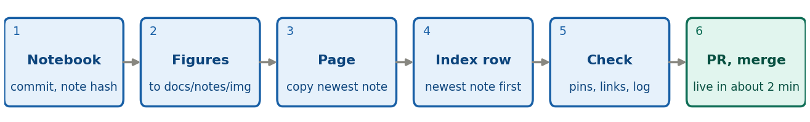

```{=latex}
\pagestyle{empty}\thispagestyle{empty}
\setlength{\parskip}{0.3em}
\setlength{\parindent}{0pt}
\renewcommand{\arraystretch}{1.05}
\vspace*{-1.2em}
\begin{center}
{\LARGE\bfseries\color{brand} Creating a note}\\[0.2em]
{\small Developer quick-sheet \textperiodcentered{} hand-written notes in \texttt{docs/notes/} \textperiodcentered{} version 1, 7 October 2026}
\end{center}
\vspace{0.2em}
```

For a note you write yourself: an HTML page in `docs/notes/` and one row in the front-page table. (Student notes are Markdown in `notes/src/`; see the box at the bottom and the [student cheat-sheet](https://villano-lab.github.io/NSDF-Data/students/note-cheatsheet.pdf).) Start from `develop`, on a branch: `git switch -c feature/note-NN-short-name` (NN is the next note number; a follow-up takes a letter, like 2a).

{width=100%}

```{=latex}
\small
```

1. **Notebook.** Do the analysis in `R76/analysis_notes/`, run it top to bottom, and commit it with any library change. Note the short hash: `git rev-parse --short HEAD`. Re-running some notebooks leaves metadata churn, so read `git diff` before committing. Never run `07221203_2025_dump1_noise.ipynb` without approval (it rewrites `archives/good_noise.h5`).
2. **Figures.** Save the PNGs from the executed notebook into `docs/notes/img/`, named for the series and the content, for example `dump1_bstd_time.png`.
3. **Page.** Copy the newest note, `note-02a-bstd-vs-time.html`, to `docs/notes/note-NN-slug.html`. Edit the `<title>`, the `<h1>` (write it as a question), the meta line (`Note NN · Author(s) · date · Status`), and the `<nav class="outline">` with an `id` on every `<h2>`. Sections: Code Repository, Data and setup, The question, one section per result (`<figure>`, alt text, caption), Reading, Caveats, Next steps.
4. **Pin the code.** Every link to a notebook or to `python/` uses the commit hash, never a branch name: under the repository URL, `blob/<hash>/<path>` for a file and `tree/<hash>/<folder>` for a folder. Check each one: `git cat-file -e <hash>:<path>` prints nothing when the file exists.
5. **Index row.** Add one `<tr>` to the Analysis Notes table in `docs/index.html`, **newest note first**. Columns: Note #, Link, Date, Author, Title, Description, Keywords, Status, Presentation. The status badge is `<span class="status in-progress">` (or `complete`, `outdated`, `abandoned`, `brainstorm`).
6. **Changelog and checks.** Add a line under `[Unreleased]` in `CHANGELOG.md` (a new note is a patch-level change). Open the page from disk in a browser: figures show, links work. If you touched `python/`, run `cd python && python -m pytest -q`.
7. **PR.** `git push -u origin feature/note-NN-short-name`, then `gh pr create --base develop --fill`. When the checks are green, merge: the page is live in about two minutes.

```{=latex}
\normalsize
```

**Rules.** A note marked **Complete** is left alone, apart from a minimal correction when a library rename makes it wrong; In-progress notes can change freely. A breaking library change means updating the notebooks that use it, or marking them deprecated (the red box described on the front page). Any whole-trace spectrum must skip the leading glitch samples. A *segment* is a run of same-trigger events; a *run* is a whole data-taking period.

::: tip
**Reviewing a student note.** The PR into `develop` shows a green check and nothing is public. Change `id: "TBD"` to the next S-number (S1, S2, ...), commit it to the PR branch, and merge. The bot builds the page and the index row, and it is live in 2 to 3 minutes. To remove a note, delete its source file in a PR; the next build removes the page.
:::
