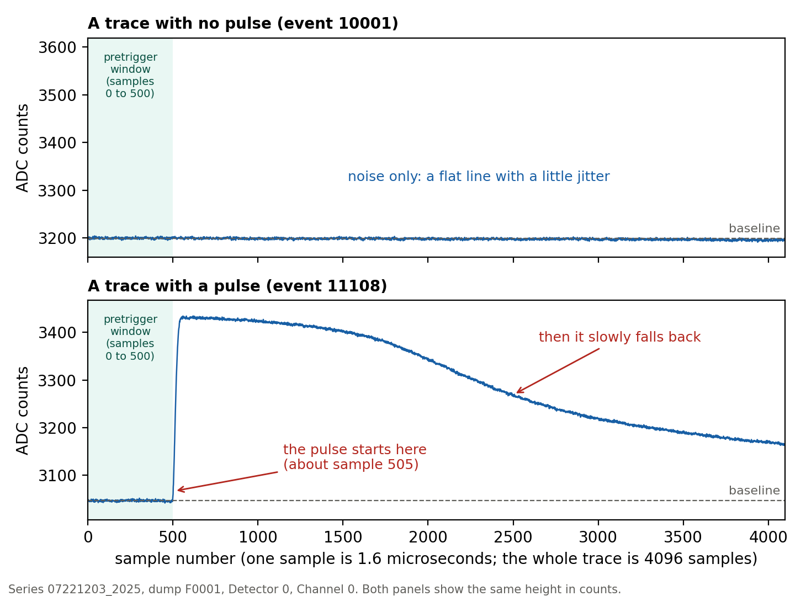
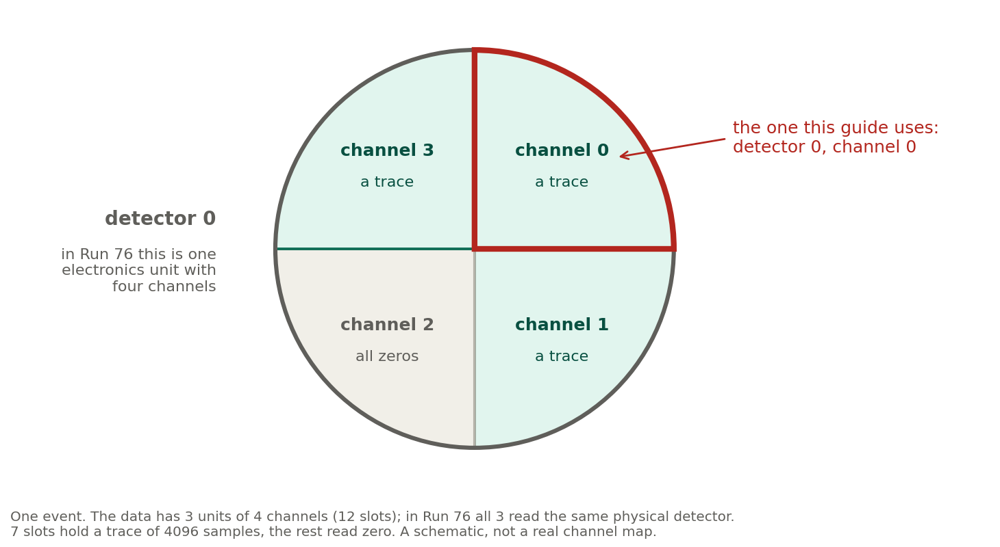

::: tip
**What you will do.** Download one set of real detector data, open it in a notebook, look at it, and reproduce one number from an existing note. You will need the setup guide for macOS finished first.
:::

## Before you start

- **Time:** about two hours.
- **You need:** the setup guide finished (your environment `darkmatter_cli_env` exists and works).
- **Check:** open a terminal (Step 1 of the setup guide), and run `conda activate darkmatter_cli_env`{.cmd}. The start of the line should show `(darkmatter_cli_env)`.
- **Folder:** you do not need to be in any particular folder yet. Each step below tells you where to go.

## Words you will meet

| Word | What it means here |
|---|---|
| **Series** | One data-taking session, named like `07221203_2025`. A typical series lasts hours; some are shorter because they are tests. |
| **Dump** | One file set taken from a series, numbered `F0001`, `F0002`, ... |
| **Event** | One moment when the system decided something might have happened and saved a short recording from every detector. Events are numbered in time order. See the picture below, and the [appendix](#appendix-what-an-event-looks-like). |
| **Detector / channel** | The software numbers the readout units 0, 1 and 2 ("detectors"), and each has four channels. In Run 76 all three read the same physical detector, so a "detector" here means one readout unit with 4 channels. We use detector 0, channel 0. |
| **Trace** | The recorded signal for one channel in one event: 4096 numbers, one per sample. |
| **Sample** | One reading. Each sample is 1.6 microseconds long, and measures the average of the output (usually a voltage) over that time interval. |
| **ADC counts** | The unit of the numbers in a trace. They are whole numbers (integers) from the analog-to-digital converter, proportional to the measured quantity (such as a voltage), but really just integers. In this dump the largest are around 8000, so they need at least 13 bits; the exact width is not stated in this guide. |
| **Baseline** | The flat level a trace sits at when nothing happens. |
| **Pretrigger window** | The first samples of a trace, used to measure the baseline. |
| **Pulse** | A sudden rise above the baseline that then slowly falls back. It is what a particle leaves in a trace. |

{width=100%}

*Figure: two traces on the same scale. Top: noise only. Bottom: a pulse.*

## Step 1. Read three notes first (about 30 minutes)

Open the notes site at [villano-lab.github.io/NSDF-Data](https://villano-lab.github.io/NSDF-Data/) and read these, in order:

1. **Note 1**, *Run76 series catalog*: what a series and a dump are.
2. **Note 1a**, *python library structure*: what each part of the code does.
3. **Note 2**, *Noise-pulse selection*: how we pick quiet traces.

You do **not** need to follow every number. Just learn the words in the table above.

## Step 2. Download the data

::: navigate
**Where am I, and what is here?** Two commands show you. Try both now; neither changes anything.

- `pwd`{.cmd} prints the folder you are in. The prompt also names it.
- `ls`{.cmd} lists the files and folders inside it.

To move, type `cd` and a folder name from the list, or `cd ..` to go back up one level.
:::

First go to your home folder, so the data lands in the right place. Type this, then press Enter:

```
cd ~
```

Now download the data:

```
nsdf-cli download 07221203_2025_F0001
```

The download puts the data in an `idx` folder **in the folder you are in**. Because you went to your home folder first, it lands in `~/idx`, inside a folder named `07221203_2025_F0001`. The data is about 34 MB. Wait until the prompt comes back.

::: careful
Never download from inside the `NSDF-Data` folder. Its `idx` folder would sit inside the project, where Git can pick it up. If you have already downloaded there, move the `idx` folder to your home folder, and tell your lead.
:::

**What these lines do:** the first one moves you to your home folder (the `cd` line). The second, `nsdf-cli download`, fetches the data set from the NSDF servers over the internet and puts it in a new `idx` folder.

::: careful
Do not move or edit the downloaded files, and do not add them to Git. They are not part of the project.
:::

::: tip
If the message says the folder already exists, the data may already be there. To check, type `ls ~/idx`{.cmd}: if the list shows a folder named `07221203_2025_F0001`, you already have it, and an error message means there is no `idx` folder yet. Ask the project lead before you delete anything.
:::

## Step 3. Open Jupyter in the right folder

Notebooks must be opened from the folder `R76/analysis_notes`, inside the project. In the terminal, type these lines:

```
conda activate darkmatter_cli_env
cd ~/Research/NSDF-Data/R76/analysis_notes
jupyter lab
```

**What these lines do:** `conda activate` switches your environment on, `cd` moves you into the folder where the notebooks live, and `jupyter lab` starts the notebook program. **Leave this terminal window open while you work**: closing it stops Jupyter.

Your web browser opens a Jupyter page. Click **File**, then **New**, then **Notebook**. If it asks which kernel to use, choose **darkmatter_cli_env**.

::: tip
A notebook is a list of boxes called **cells**. Type code in a cell and press **Shift + Enter** to run it. The result appears under the cell. Press **Enter** (without Shift) to keep typing in the same cell.
:::

Give your notebook a name: right-click its tab at the top (it says `Untitled.ipynb`) and choose **Rename Notebook**. In the box, replace `Untitled` with `first-analysis-yourname` (keep `.ipynb` at the end) and click **Rename**.

## Step 4. Load the data and count the traces

Copy this into the first cell and press **Shift + Enter**:

```python
import sys
from pathlib import Path

# Tell Python where the pulse library (the python folder) is.
# This looks upward from the notebook's folder until it finds the project,
# so it works wherever in the project your notebook is.
here = Path.cwd().resolve()
REPO = next((p for p in [here, *here.parents] if (p / "python" / "pulse_io.py").exists()), None)
assert REPO, "Start Jupyter from inside the NSDF-Data folder."
sys.path.insert(0, str(REPO / "python"))

from nsdf_dark_matter.idx import load_all_data
import pulse_io as pio

# Open the dump you downloaded.
cdms = load_all_data(str(Path.home() / "idx" / "07221203_2025_F0001"))

# Take every trace from detector 0, channel 0, into one table.
ids, pulses = pio.load_channel_batch(
    cdms, pio.filter_by_detector(cdms.get_detector_ids(), 0), 0)

print(pulses.shape)
```

::: checkpoint
The output is `(1517, 4096)`: 1517 traces, each with 4096 samples. If you get a different number, stop and check the dump name and the folder in Step 2.
:::

## Step 5. Look at a trace

Put this in a new cell (click **+** in the toolbar, or use the menu **Insert**, then **Insert Cell Below**), and run it:

```python
import matplotlib.pyplot as plt

plt.plot(pulses[0])
plt.xlabel("sample (1.6 microseconds each)")
plt.ylabel("ADC counts")
plt.show()
```

Now change the `0` to `1`, `2`, `3` and run again. Most traces look like flat noise, with a little jitter. Row 1 is a quiet trace like the top one in the figure above. To see a pulse, try row `1095`. Then see the [appendix](#appendix-what-an-event-looks-like) if you want to know more about what you are looking at.

## Step 6. Reproduce a number from Note 2

Note 2 says that for this dump, a strict selection leaves **179 quiet traces**. Run this in a new cell:

```python
from dataclasses import replace
from pulse_config import DEFAULT_CONFIG
import pulse_quantities as pq
import pulse_cuts as pc
import numpy as np

c500 = replace(DEFAULT_CONFIG, pretrigger_samples=500)
quiet = pc.excursion_band(pulses, c500) & (np.log10(pq.bstd(pulses)) < 0.5)
print(quiet.sum())
```

::: checkpoint
The output is **179**. If you see a different number, that is worth knowing. Write down the number you got and the steps you took, and tell the project lead. Do not change the project's code to make the number match.
:::

## Step 7. Write down what you did

In Jupyter, click **+** to add a cell and change its type from *Code* to **Markdown** in the toolbar. In that cell, write a few sentences in plain English: what you loaded, what you plotted, and what number you got. Then press **Shift + Enter**.

Save with **Command + S** (macOS) or **Ctrl + S** (Windows and Linux).

Once your branch exists (setup guide, Step 8), save your notebook to Git. The first terminal is busy: it is still running Jupyter, so leave it open. Open a **new** terminal for the Git commands. A new terminal starts in your home folder, so the first line below moves you into the project folder from the setup guide:

```
cd ~/Research/NSDF-Data
git add R76/analysis_notes/first-analysis-yourname.ipynb
git commit -m "First analysis: load dump 1 and count the quiet traces"
git push -u origin student-yourname
```

**What these lines do:** `git add` picks the file you want to save, `git commit` saves a snapshot of it with your short message, and `git push` uploads that snapshot to GitHub, to your own branch.

::: careful
Commit only your notebook. Check the list before committing with `git status`. If you see `.bin` files or anything from the `idx` folder, do not add them.
:::

## You are done when

- [ ] `(1517, 4096)` printed after loading the data.
- [ ] You plotted at least three traces and can say what the flat ones look like.
- [ ] You got 179 from the selection, or wrote down what you got and why you think it differs.
- [ ] Your notebook is saved, and committed to your branch if you have access.

## Common problems

| What you see | What to do |
|---|---|
| `ModuleNotFoundError: No module named 'nsdf_dark_matter'` | You are not in the environment. Run `conda activate darkmatter_cli_env`{.cmd}, then restart the notebook kernel (**Kernel**, then **Restart Kernel**). |
| `ModuleNotFoundError: No module named 'pulse_io'` | Jupyter was started from the wrong folder. Close it and start it again from `R76/analysis_notes`. |
| `FileNotFoundError` on the dump folder | The download did not finish, or it went somewhere else. Check the folder in Step 2. |
| A huge spike at the very start of traces | This is a real electronics glitch in the first few samples, not a bug. It is explained in Note 2a. |
| The kernel is not `darkmatter_cli_env` | Click the kernel name at the top right and choose **darkmatter_cli_env**. |

::: careful
Do not run `07221203_2025_dump1_noise.ipynb` unless the project lead says it is fine. It overwrites a shared archive file.
:::

## Appendix: what an event looks like

You do not need this to finish the guide. It explains the words in the table at the top.

The detector system watches its sensors all the time. Whenever it decides that something may have happened, it saves a short recording from every sensor. That moment is one **event**. Events are numbered in time order, and the numbers restart in every dump, so an event number alone does not identify an event.

In Run 76 one physical detector (a silicon detector, S104) is read out by three older ("legacy") electronics units, each with four **channels**, all connected to that same detector. The software calls the units detector 0, 1 and 2, and so does this guide. One event therefore holds up to 3 x 4 = 12 recordings. Each recording is a **trace**: 4096 numbers, one per sample. In this dump, 7 of the 12 slots hold a trace and the other 5 read all zeros. We follow one channel, detector 0 channel 0, through all 1517 events.

{width=90%}

*Figure: the four channels of detector 0 in one event. It is a schematic: the four sectors only stand for the channel numbers, and it does not show where the real sensors sit. The detector's own sensor layout is similar to the SuperCDMS HV detector mask, but not the same.*

A trace looks like a flat line with a little jitter (the **baseline**) until something happens. The first 500 samples, the **pretrigger window**, are used to measure the baseline. If a particle deposits energy, the trace jumps up at once and then slowly falls back: a **pulse**. In the figure in the words table, the pulse in event 11108 starts just after sample 500; in this dump, many pulses start there.

The trace in the figure is row 1095 of the table `pulses` from Step 4 (the row is the position in the table, not the event number). Row 1 is a quiet trace.

## Where to get help

**Anthony Villano**, project lead: <anthony.villano@ucdenver.edu>

When you write, include the step number, the command you typed, and the last few lines the computer printed. A screenshot helps. Nobody will be annoyed by a question about a step that did not work.

## Session Info

Guide version 13, 9 October 2026, macOS edition. Written for beginners; please tell the project lead where a step was unclear.

## Key links

- Note 1: <https://villano-lab.github.io/NSDF-Data/notes/note-01-run76-series-catalog.html>
- Note 1a: <https://villano-lab.github.io/NSDF-Data/notes/note-01a-pulse-library-structure.html>
- Note 2: <https://villano-lab.github.io/NSDF-Data/notes/note-02-noise-selection.html>
- Repository: <https://github.com/villano-lab/NSDF-Data>
