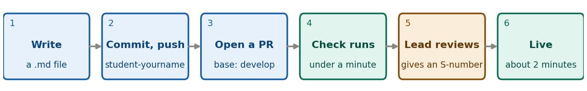

```{=latex}
\pagestyle{empty}\thispagestyle{empty}
\setlength{\parskip}{0.35em}
\setlength{\parindent}{0pt}
\renewcommand{\arraystretch}{1.1}
\vspace*{-1.2em}
\begin{center}
{\LARGE\bfseries\color{brand} From note to live page}\\[0.2em]
{\small NSDF-Data student cheat-sheet \textperiodcentered{} version 2, 7 October 2026}
\end{center}
\vspace{0.3em}
```

A one-page reminder. The full steps are in [guide 3, writing a note](https://villano-lab.github.io/NSDF-Data/students/writing-a-note.pdf) and [guide 4, publishing a note](https://villano-lab.github.io/NSDF-Data/students/publishing-a-note.pdf). **Nothing is public until your lead merges your pull request (PR).**

{width=100%}

```{=latex}
{\footnotesize\textit{Blue: you. Teal: GitHub, automatically. Amber: your lead. A PR is a page on GitHub that asks to add your branch to the project.}}
```

**Before you push**

- Your note is `notes/src/your-note-name.md`, your pictures are in `notes/src/img/`, the header is complete, and it says `id: "TBD"`.
- Every link to your code is pinned to a **commit hash**: not `develop`, `master` or `COMMIT`. Remove the template's `img/example.png` line, and any `<u>`, `<sup>`, `<sub>` or `<span>` tags.
- Optional: with your environment active, run `python tools/build_notes.py check`. It finds the problems the PR check would.

**Commands**, from the `NSDF-Data` folder, on your own branch:

```{=latex}
\footnotesize
```

```bash
git checkout student-yourname
git add notes/src/your-note-name.md notes/src/img
git status             # only your note and its pictures? no .bin files, no idx folder?
git commit -m "Add note: your title"
git push -u origin student-yourname
```

```{=latex}
\normalsize
```

Then open the repository on [github.com](https://github.com), click **Compare & pull request**, check that the **base** is `develop`, and click **Create pull request**.

**If the check says…** (click **Details** on the check to read it)

| Message | What to do |
|---|---|
| `header field 'X' is missing or empty` | Fill in that line of the header. |
| `status must be one of ...` | Use exactly *In progress*, *Complete* or *Outdated*. |
| `notebook link pinned to 'master'`, or `placeholder COMMIT is still in the note` | Use the real commit hash. |
| `raw HTML tag <u>` (or `<sup>`, `<sub>`, `<span>`) | Remove the formatting, keep the words. |
| `picture not found` | Check the file name, and that it is in `notes/src/img/`. |

Fix it on your branch, commit and push again. The PR updates itself and the check runs again.

**After that.** Your lead reads the note, may comment on the PR (answer there), and gives it an S-number when it is ready. About two minutes after the merge your page is live, in the **Student notes** table on the front page. To change a published note, first run `git switch student-yourname && git pull origin develop` and check that the header still has your S-number (not `TBD`); then commit, push and open a new PR, update the date, and never delete a note to hide a mistake.

**Never** work on `master` or `develop`, or commit data (`.bin` files, the `idx` folder) or other people's notes. Stuck? Write to Anthony Villano, <anthony.villano@ucdenver.edu>, with the PR number, the check's message and the step you are on.
