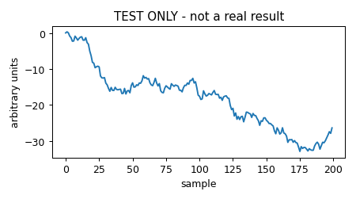

## Code repository

- [`good_pulses_overlay.ipynb`](https://github.com/villano-lab/NSDF-Data/blob/3f4131b/R76/analysis_notes/good_pulses_overlay.ipynb) — any notebook will do; pinned to commit `3f4131b`.

## Data and setup

This is **not a real note**. It contains no analysis. It exists only to check that a pull request, the review step, the build and the live page all work.

## Results

## Caveats

- This note will be deleted after the test.
- Do not cite it.
